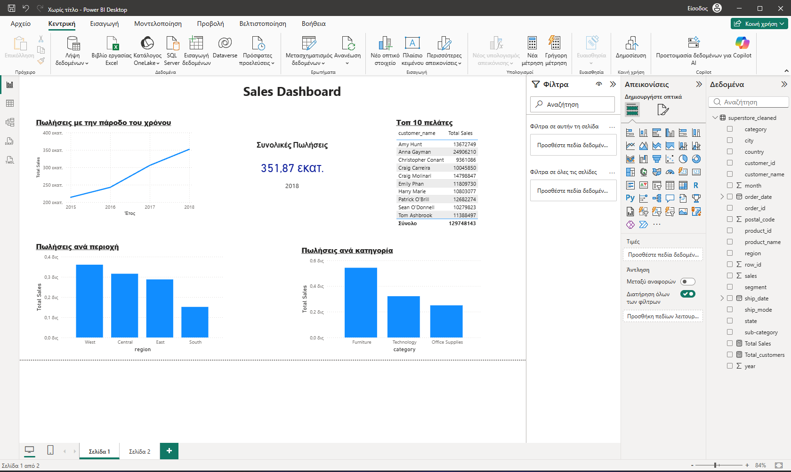
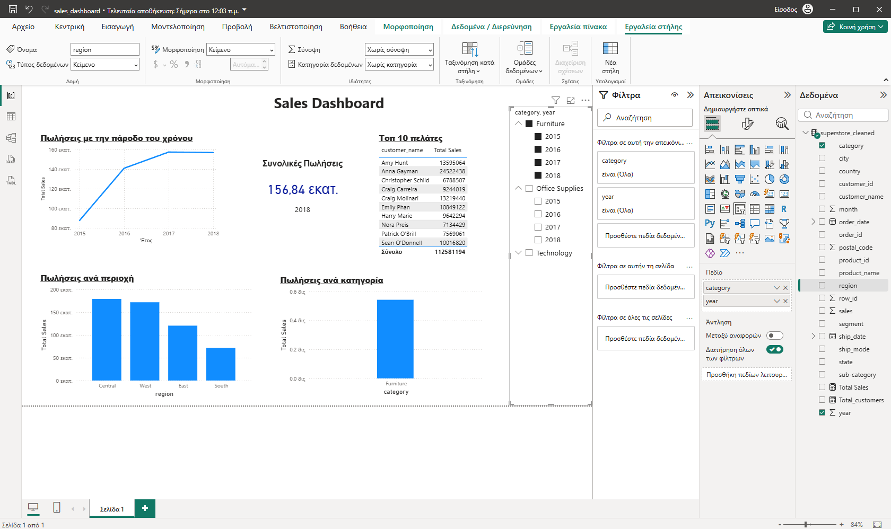
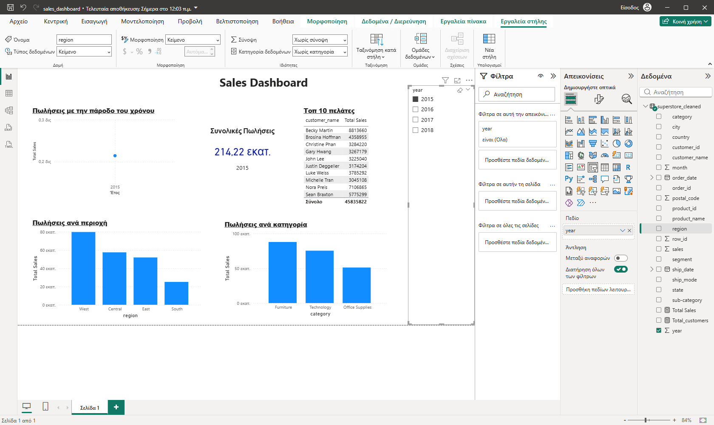
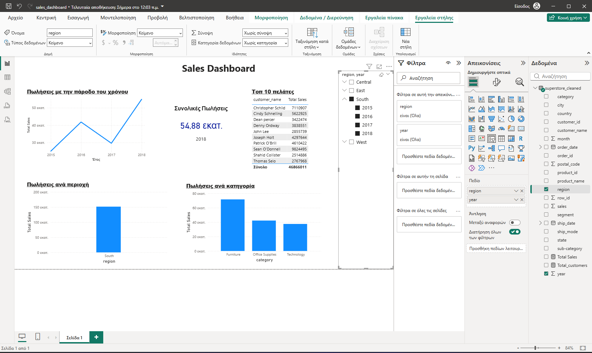

# Superstore-Sales-Data-Analysis
📊 **Sales Performance Analysis**

📌 **Problem**

The company lacks visibility into sales performance across products and regions.

🎯 **Objective**

Analyze sales data to identify trends, top-performing products, and performance in relation to areas.

⚒️ **Tools Used**

  - SQL
  - Python (Pandas)
  - Power BI

📂 **Dataset**

  - Source: https://www.kaggle.com/datasets/rohitsahoo/sales-forecasting?resource=download
  - Includes:
    - Orders
    - Products
    - Customers
    - Sales

🔍 **Key Analysis**

  **SQL Analysis:**
<ul>
      <li> Total Sales by month </li>
      <li> Top 10 customers </li>
      <li> Trending products. </li>
</ul>

  **Data Cleaning (Python):**
<ul>
        <li> Removed null values </li>
        <li> Handled duplicates </li>
        <li> Create new columns </li>
</ul>

📈 **Dashboard**    
 
 <h1>Total Sales</h1> 

 

💡 **Key Insights**

   - Furniture has higher sales throughout the years.
   - South region underperforms compared to others.
   - A small group of customers generates most revenue.

 ✔️ **Recommendations**

   - Focus on high-performing products.
   - Improve pricing strategy in low-performing regions.
   - Target top customers for retention.

🚀 **Project Structure**

📁 **data**
   <ul> 
     <li>Contains the dataset used in the project.</li>
     <li>Includes both raw data and cleaned data.</li>
   </ul>

📁 **notebooks**

   <ul>
    <li>Includes Python notebooks used for data cleaning.</li>
   </ul>

📁 **sql**
    <ul>
      <li>Contains SQL queries used for data analysis and answering business questions.</li>
    </ul>
    
📁 **powerbi**

   <ul>
     <li>Includes the Power BI dashboard file (.pbix) and screenshots of the report.</li>
   </ul>  

📁 **README.md**
    <ul> 
      <li>Provides an overview of the project, tools used, and key insights from the analysis.</li>
    </ul>  

📸 **Screenshots**

<h2>Furniture is the top performing category throughout the years</h2>

 

<h3>2015 was the most underperfoming year</h3>

<h4>South is the most underperforming region throughout the years</h4>

🧾 **requirements.txt**

    - pandas

🖇️ **How to Run**

1. Clone the repo

2. Install requirements

3. Run notebook
